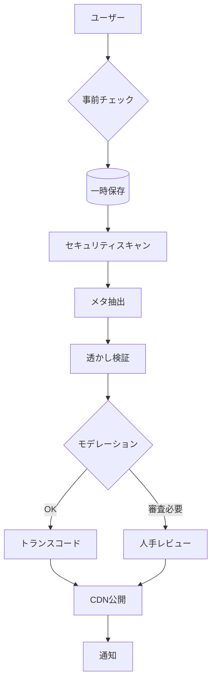
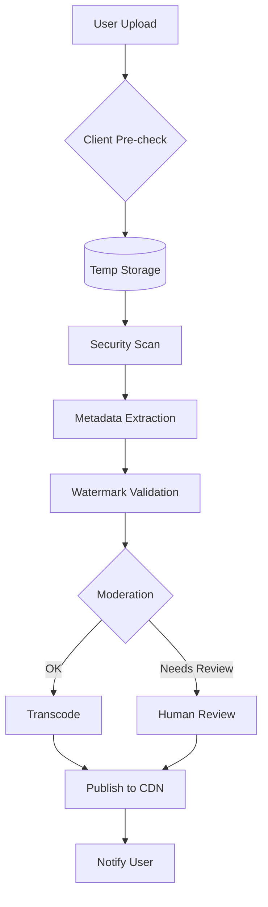

# アップロード取込パイプライン（UGC Ingestion Pipeline）
# Upload Ingestion Pipeline (for User-Generated Content)

---

## 概要 （日本語）

ユーザーが **Sora2** などの生成ツールで作成したショート動画を、  
安全かつ確実に受け取り、検証・変換・配信するための処理パイプラインです。  

AI生成は本サービス内で行わず、  
**ユーザーが外部で生成した動画を投稿**する仕組みを前提とします。

---

## Overview (English)

This pipeline handles **user-generated short videos** created with tools such as **Sora2**.  
It securely ingests, validates, converts, and publishes the videos for viewing and sharing.  

Unlike some AI video services, **Airis does not generate videos internally** —  
instead, it provides a platform for users to **upload and share AI-created content** safely.

---

## アップロード～公開までの流れ

1. **クライアント検証**  
   ファイル拡張子・概算サイズ・長さ・フォーマットを事前チェックします。

2. **一時保存**  
   アップロードされた動画を一時バケットに格納し、ウイルススキャン・メタ検査を行います。

3. **メタデータ抽出**  
   解像度・フレームレート・動画長・コーデック・ハッシュ値などを記録します。

4. **透かし／出典検証**  
   Sora2などのウォーターマークを検出し、生成元の正当性をスコア化します。

5. **自動モデレーション**  
   不適切コンテンツ（NSFW・暴力・差別表現など）を自動分類します。

6. **トランスコード処理**  
   ストリーミング用（HLS/DASH）への変換とサムネイル生成を行います。

7. **公開判定／審査**  
   モデレーションスコアに応じて、自動公開または人手レビューに振り分けます。

8. **CDN配置／通知**  
   公開された動画をCDNへ反映し、ユーザーに通知します。

9. **監査ログ**  
   すべての工程で `request_id` を伝搬し、監査ログに記録します。

---

## Upload-to-Publish Flow (English)

1. **Client Validation**  
   Checks the file extension, approximate size, duration, and format before upload.

2. **Temporary Storage**  
   Stores the uploaded file in a temporary bucket and runs virus/malware scans.

3. **Metadata Extraction**  
   Captures resolution, framerate, duration, codec, and hash of the uploaded file.

4. **Watermark & Attribution Check**  
   Detects Sora2 (or other) watermarks to verify the origin and calculate a confidence score.

5. **Automatic Moderation**  
   Classifies inappropriate content (e.g., NSFW, violent, discriminatory material).

6. **Transcoding**  
   Converts video for streaming (HLS/DASH) and generates thumbnails.

7. **Publication Review**  
   Based on moderation score, content is either auto-published or sent for manual review.

8. **CDN Deployment & Notification**  
   Publishes the video to CDN and notifies the uploader.

9. **Audit Logging**  
   All steps propagate a `request_id` for traceability and auditing.

---

## 非同期設計

- 受付APIはジョブID（`job_id`）を返し、  
  クライアントはポーリングまたはWebSocketで進捗を取得します。  
- 失敗時は指数バックオフで再試行し、致命的エラーはデッドレターキューに送られます。

---

## Asynchronous Design

- The upload API returns a `job_id`, allowing clients to check progress via polling or WebSocket.  
- Failed jobs are retried using exponential backoff.  
  Critical failures are sent to a dead-letter queue for manual inspection.

---

## Mermaid図（Japanese）

## Mermaid図（English）

